# Bird-Bird-Ordering

## Overview
This application was built for customers at Bird Bird Biscuit to place orders for multiple biscuits in dozens, in an easy to use ordering form. Designed using Adobe XD, created using React.js in the front end and Express.js in the back end, the aim was to make the ordering form as accessible as possible while still retaining the same design cues as featured on their own website. 
The ordering form contains two pages. 
* The first page is the customer facing page, where they can select their desired quantity of biscuits, any extras and a tip, then checkout safely and securely with a payment modal which utilizes Stripe.js. I decided on Stripe.js as it is a well renowned payment service and has features many ways of making payments. The customer's order is then stored in a MySQL database and they receive a confirmation email. 
* The second page is a well-hidden employee view, where the employee can see all orders that have been placed, view monthly, weekly, and daily totals, and also mark orders as complete. 

#### Customer View
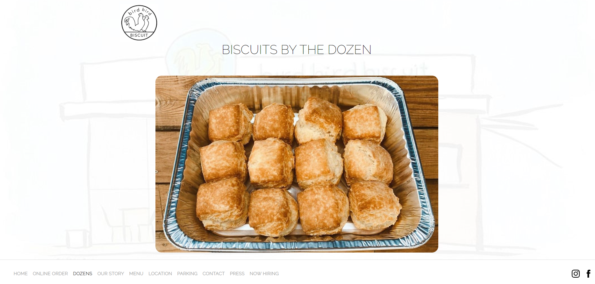

#### Employee View
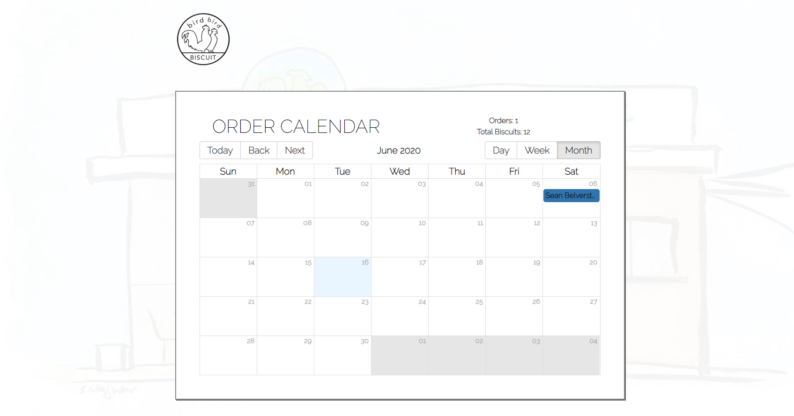

### User Interaction Logic
#### Customer View
1. Select quantity, add gravy or jam, then the user has the option to add a tip. If they'd like to choose a custom tip, they can click the button and a hidden text box appears, which contains validation to make sure only the correct input is received.

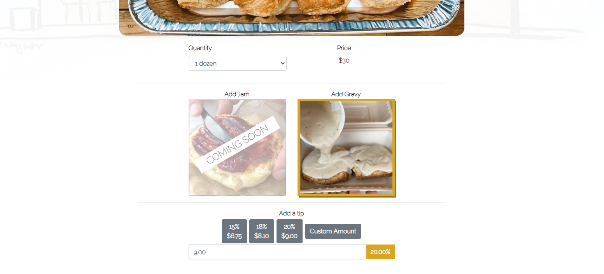

2. The user is then able to select a pick-up date and time of their choosing. The available dates are automatically scheduled for 2 days in advance, to enable the shop to make sure they have stock for orders placed. The user is also only permitted to enter a time within the range of Bird Bird Biscuit's opening hours (8am - 2pm). 

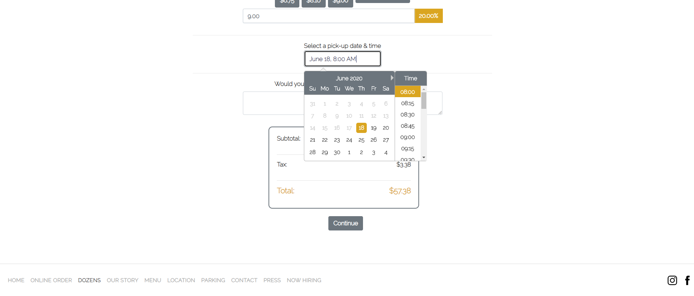

3. After selecting a time, there is a text box for any special instructions the user may need to enter. Below this, their total costs are laid out in an easy to read format, showing the subtotal, tax, and final total. 

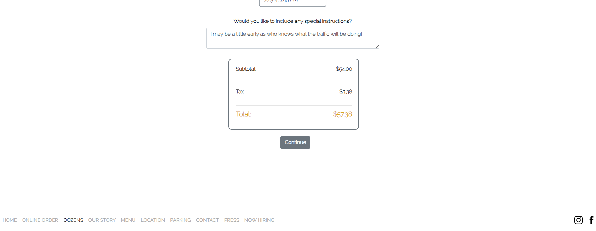

4. Once their selection is complete and the continue button has been clicked, a payment modal appears. This is where the user can enter their information to process the order. Their card details are entered in just below this. I made sure to disable the option to click away from the modal, as this is often done by accident and would require the user to enter in their details again. There is a close button at the top right just in case they need to edit their order or go back for any reason.

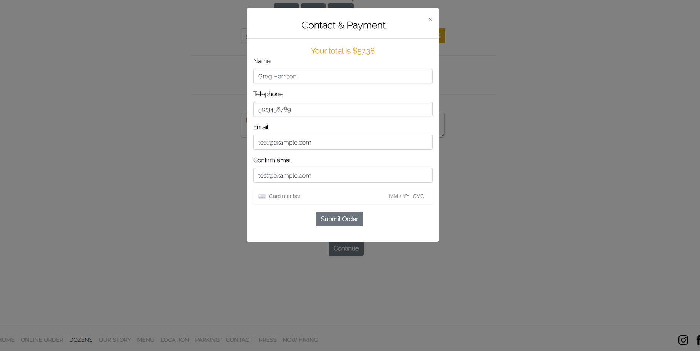

5. Finally, once all of the user's details have been entered and there aren't any issues with their card, the order is placed and a notice pops up informing them that their order has been successful and an email will be on its way to their inbox shortly. If there are any problems with the card, a similar notice displays telling them of an issue.

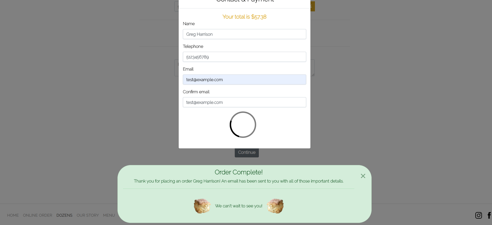

#### Employee View
1. If the user hovers over the little Bird Bird Biscuit logo on the top left, they will discover that it is actually a button, and the words "Employee View" appear above the button. I decided to make it a bit more of a subtle button, rather than a clear one, to display a more professional setting.

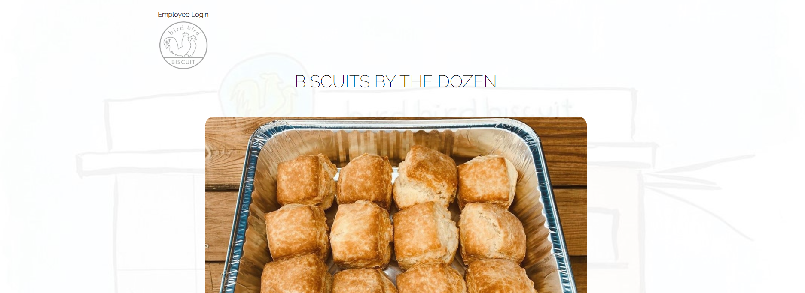

2. Once the employee has clicked this button, they will be promoted to login. There will only ever be a single login, which has been passed directly to the owners of Bird Bird. Also, if the user mistakenly visited this page, they could return back to the main one by the same way they came in.

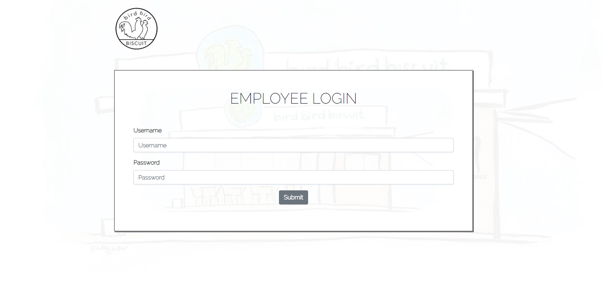

3. The order calendar that the employee is shown is designed in a way to be simple, aesthetically pleasing, and to be easy enough for the user to locate orders quickly. Orders are retrieved from the MySQL database and stored in "events". These events are clickable and display all the data provided by the customer. On the top right hand-side of the calendar, there is a totals area, displaying the orders and biscuits relating to the view that you are currently in. If you change the view to week, or day, these numbers update accordingly.

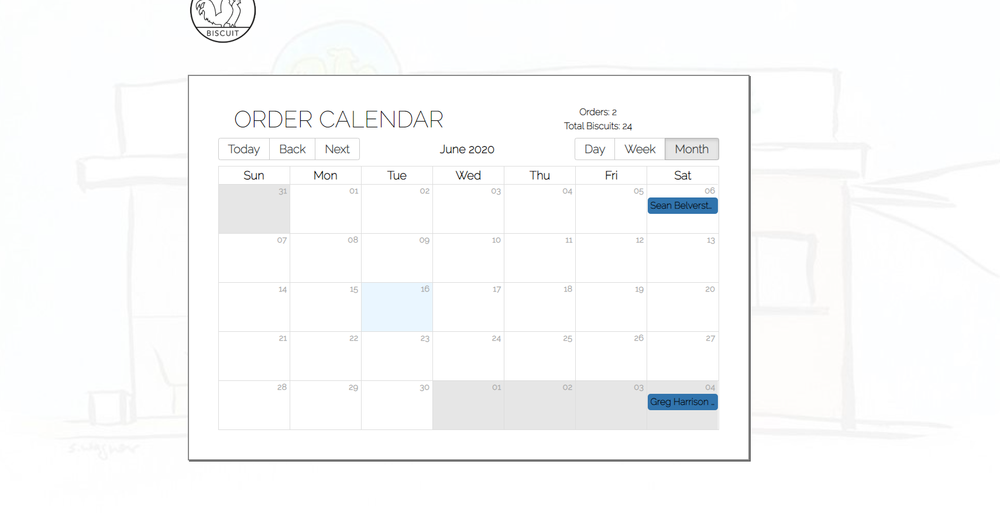
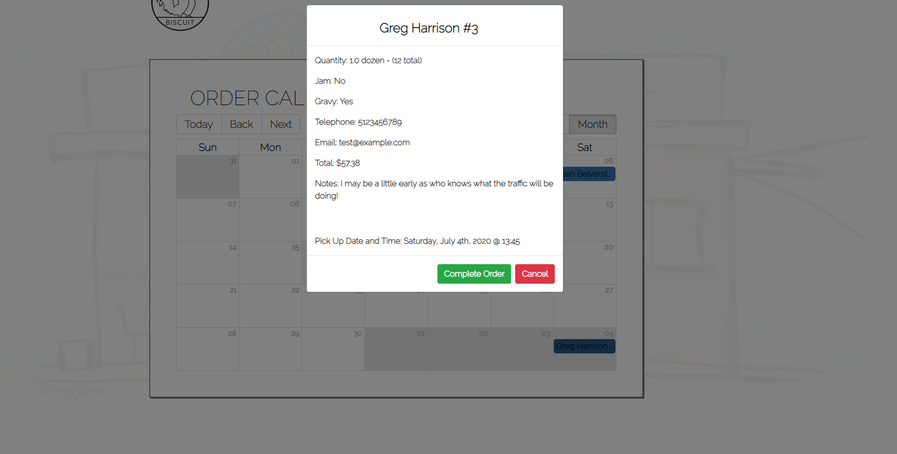

4. When the order has been fulfilled, the employee can click the "Complete Order" button and the event turns golden, making it easy to determine if it has been finished or not. 

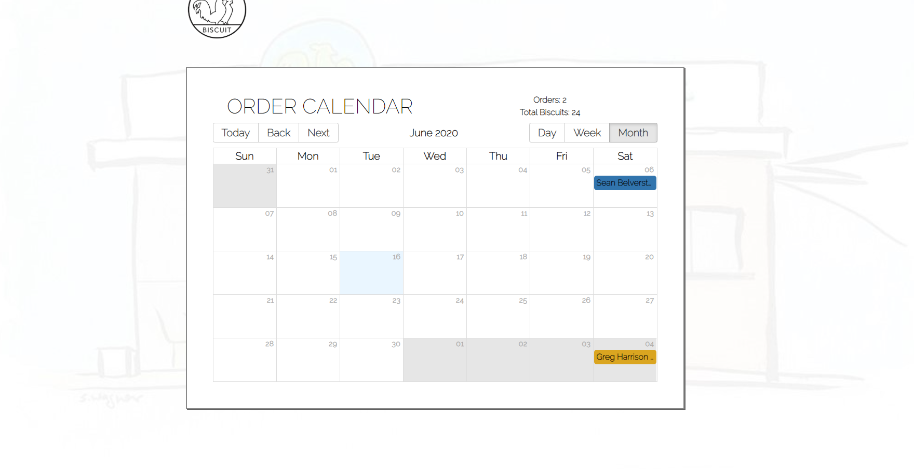

### Technologies Used
* React
* Express
* MySQL
* Sequelize
* Date/fns
* React-big-calendar
* React-date-picker
* Stripejs
* Emailjs

Live Heroku Link: [https://birdbirdbiscuit.herokuapp.com/]